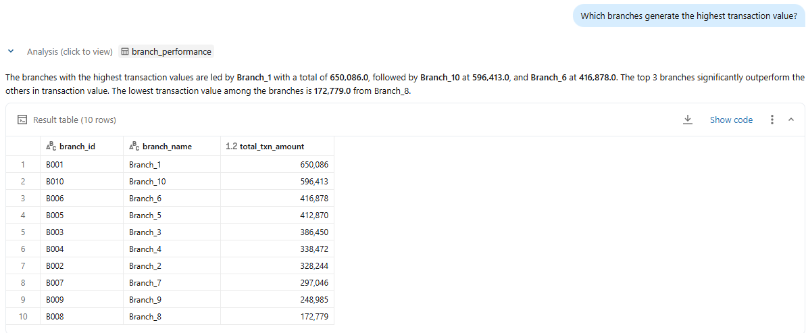
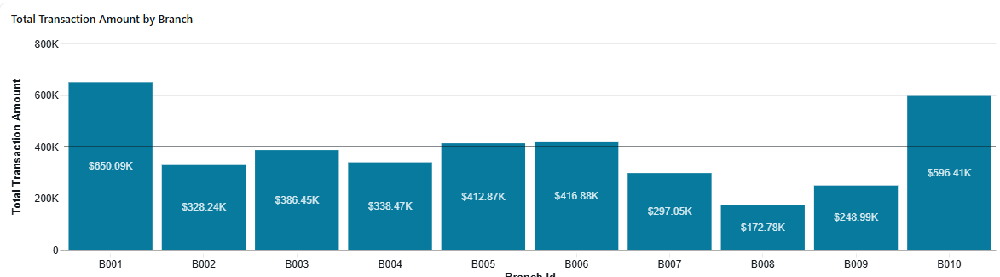
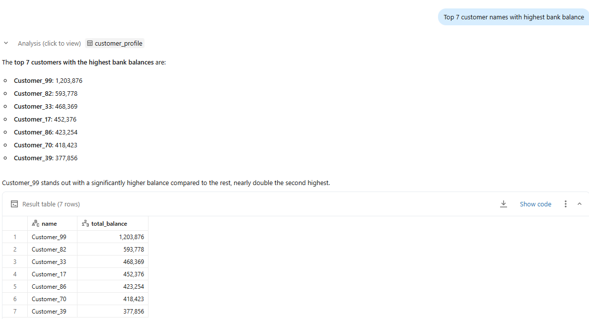
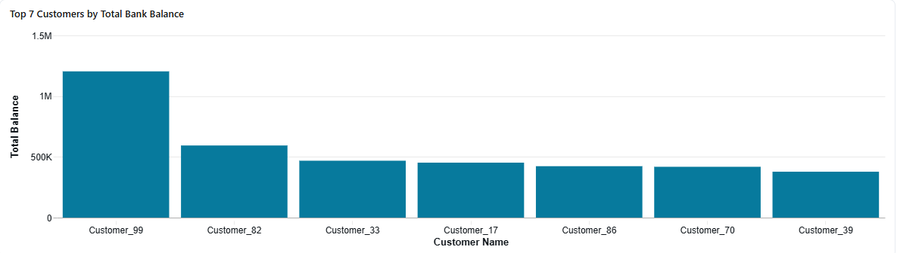
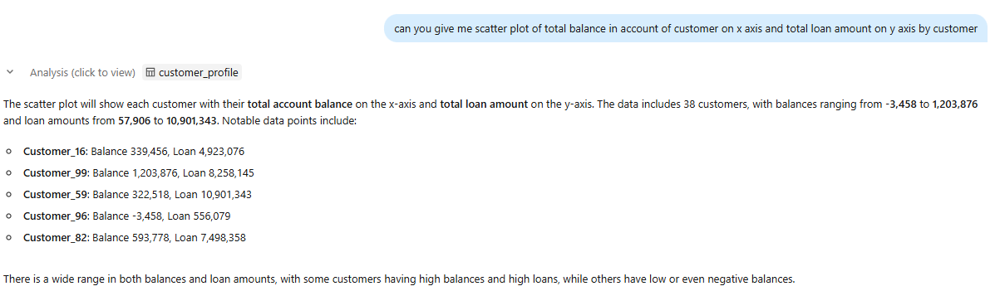
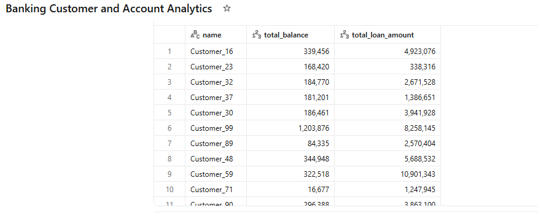
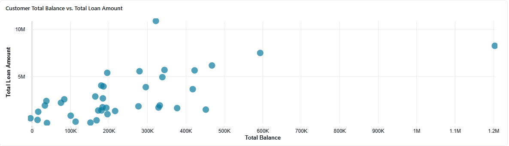

# 1. Project Overview

This project implements an data engineering pipeline for a retail banking domain using **Spark Declarative Pipelines in Databricks**.

The pipeline ingests raw banking datasets, applies data quality checks, cleans and transforms the data and produces analytical datasets that can be consumed by BI tools such as Microsoft Power BI.

The implementation follows the **Medallion Architecture**:

The project demonstrates **data ingestion, transformation, validation, and aggregation across multiple relational datasets**.

---

# 2. Dataset Description

The project simulates a **retail banking system** with multiple datasets.

### Tables

| Table        | Description                         |
| ------------ | ----------------------------------- |
| Branches     | Bank branch information             |
| Customers    | Customer demographic information    |
| Accounts     | Bank accounts owned by customers    |
| Transactions | Financial transactions for accounts |
| Loans        | Loan records issued to customers    |

---

# 3. Data Quality Issues

The dataset intentionally includes several **real-world data quality problems**.

Examples:

* Missing values in customer city and age
* Negative account balances
* Null transaction amounts
* Duplicate transaction records
* Missing loan status values

These issues are handled in the **Silver layer** of the pipeline.

---

# 4. Architecture

Pipeline architecture follows the **Medallion data architecture** pattern.
* **Bronze layer** – raw data files
* **Silver layer** – cleaned and validated data
* **Gold layer** – analytics-ready business tables

# 5. Pipeline Layers

## Bronze Layer

Purpose: Raw data ingestion.

Tables created:
```
bronze_customers
bronze_accounts
bronze_transactions
bronze_loans
bronze_branches
```
---

## Silver Layer

Purpose: Clean and validate data.

Transformations include:

* Removing duplicate transactions
* Filtering invalid balances
* Handling missing values
* Applying data quality expectations

Example rules implemented:

| Rule                 | Description              |
| -------------------- | ------------------------ |
| customer_id not null | Valid customer records   |
| balance >= 0         | Valid account balances   |
| amount > 0           | Valid transaction values |
| loan_status default  | Missing values replaced  |


## Gold Layer

Purpose: Build **analytics-ready business datasets**.


### Gold Tables
---

**Branch Performance**

Metrics:

* total transactions
* total transaction value

---

**Account Summary**

Metrics:

* number of accounts per account type
* total balance per account type

---

**Customer Financial Summary(Profile)**

Metrics:

* number of accounts per customer
* total account balance

---

**Customer Transaction Summary**

Metrics:

* number of transactions per customer
* total spend per customer

---

**Loan Analytics**

Metrics:

* loan distribution by type
* total loan value

---

# 6. Technologies Used

| Technology         | Purpose                        |
| ------------------ | ------------------------------ |
| Databricks         | Data engineering platform      |
| Apache Spark       | Distributed processing         |
| Delta Live Tables  | Declarative pipeline framework |
| Python / PySpark   | Data transformations           |
| CSV datasets       | Source data                    |
| Microsoft Power BI | Visualization                  |

---

# 7. Project Folder Structure

```
databricks_bankingproj

data/
   branches.csv
   customers.csv
   accounts.csv
   transactions.csv
   loans.csv

pipelines/
   silver_pipeline.py
   gold_pipeline.py


README.md
```

---

# 8. Sample Business Insights

The pipeline enables the following analysis:

Example questions:

* Which branches generate the highest transaction value?

  
 
  
  
* Which customers have the highest account balances?





* Distribution of customers by account balance and load amount






---

